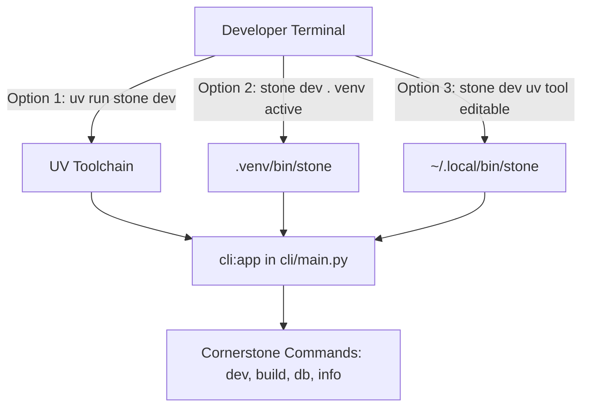

# Requirements

### Overview & Goals

Provide a seamless, out-of-the-box mechanism for developers who fork Cornerstone to interact with the project CLI using
short, customized commands (such as `cornerstone`, `stone`, or their custom application slug) without needing `just` or
verbose `uv run python -m cli` invocations.

### Scope

- **In Scope:**
    - Support both `cornerstone` and `stone` out-of-the-box as registered CLI entrypoints in `pyproject.toml`.
    - Add `--alias` / `-a` support to `python3 -m cli init` so developers can register custom aliases (e.g. `stone`,
      `mycli`) during rebranding.
    - Automatically update `[project.scripts]` in `pyproject.toml` when rebranding the project.
    - Enhance `setup` and `init` command outputs to inform developers how to use their alias directly (e.g., via
      `uv run <alias>`, active virtualenv, or `uv tool install --editable .`).
    - Update CLI documentation (`cli/commands/docs.py`), `README.md`, `AGENTS.md`, and test suites.
- **Out of Scope:**
    - Modifying user shell configuration files (`.zshrc`, `.bashrc`) automatically without user intent.
    - Modifying core application runtime behavior outside of CLI entrypoints.

### User Stories

- **As a template user**, I want to run `uv run stone dev` or `stone dev` (when venv is active or installed via
  `uv tool`) so that I don't have to type long command strings.
- **As a developer rebranding the template**, I want to specify `--alias myapp` or `--alias stone` when running `init`
  so that my customized project automatically registers my preferred CLI commands in `pyproject.toml`.

### Functional Requirements

1. **Default Aliases:** The default template `pyproject.toml` must declare both `cornerstone = "cli:app"` and
   `stone = "cli:app"` under `[project.scripts]`.
2. **Rebranding CLI Argument:** `cli init` must accept an `--alias` / `-a` option (supporting multiple aliases, e.g.,
   `--alias stone --alias app`).
3. **Dynamic Script Rewriting:** When `cli init` is run, `pyproject.toml`'s `[project.scripts]` section must be updated
   to map the new app slug and all specified aliases to `"cli:app"`.
4. **Developer Guidance:** When running `setup` or `init`, output messages must show developers how to use the CLI
   directly:
    - Within virtual environment: `<alias> <command>`
    - With UV: `uv run <alias> <command>`
    - System-wide editable install: `uv tool install --editable .`

# Technical Design

### Current Implementation

- `pyproject.toml` currently defines `[project.scripts]` with only `cornerstone = "cli:app"`.
- `cli/commands/init.py` updates `[project]` fields (`name`, `version`, `description`) and `[tool.app] display-name`,
  but leaves `[project.scripts]` unchanged.
- `cli/commands/setup.py` suggests running `python3 -m cli dev` upon completion.

### Key Decisions

1. **Standard `[project.scripts]` Entrypoints (PEP 621):**
    - *Rationale:* Standardized across all Python tooling (UV, Pip, Virtualenv). UV automatically builds executables in
      `.venv/bin/` for every script declared in `[project.scripts]`.
    - *Direct Invocation:*
        - `uv run stone <command>`
        - When `.venv` is activated: `stone <command>`
        - Global availability: `uv tool install --editable .` creates symlinks in `~/.local/bin/` so `stone` /
          `cornerstone` can be run from any terminal directory.
2. **Rebranding Integration via `init --alias`:**
    - *Rationale:* Eliminates manual editing of configuration files when creating a new application from the template.
3. **Multi-Alias Support:**
    - *Rationale:* A user may want both their formal app slug (e.g., `task-flow`) and a shorthand alias (e.g., `tf` or
      `stone`).

### Proposed Changes

#### 1. `pyproject.toml`

Add `stone` to default scripts:

```toml
[project.scripts]
cornerstone = "cli:app"
stone = "cli:app"
```

#### 2. `cli/commands/init.py` & `cli/main.py`

- Extend `rebrand(...)` and `update_pyproject(...)` to accept `aliases: list[str] | None`.
- In `update_pyproject`, replace the `[project.scripts]` block:

```python
def update_pyproject(
        display_name: str,
        slug: str,
        description: str,
        aliases: list[str] | None = None,
) -> None:
    ...
    # Generate scripts map with slug and aliases
    script_names = [slug] + [a for a in (aliases or []) if a != slug]
    scripts_section = "[project.scripts]\n" + "\n".join(
        f'{_toml_escape(name)} = "cli:app"' for name in script_names
    )
    # Replace existing [project.scripts] or append
```

- Update `init_command` in `cli/main.py`:

```python
@app.command("init", short_help="Rebrand this template into your own application.")
def init_command(
        name: Annotated[list[str], typer.Argument(help='Human-facing app name, e.g. "My App"')],
        description: Annotated[str, typer.Option("--description", "-d", help="Short project description")] = "",
        alias: Annotated[list[str] | None, typer.Option("--alias", "-a",
                                                        help="Custom CLI command alias(es) (e.g. -a stone)")] = None,
        clean_examples: Annotated[
            bool, typer.Option("--clean-examples", help="Remove placeholder example code")] = False,
):
```

#### 3. `cli/commands/setup.py`

Enhance setup completion message to highlight direct CLI alias usage:

```python
typer.echo(
    f'You can now run "{typer.style("uv run stone dev", fg=typer.colors.CYAN, bold=True)}" or activate your venv.')
```

#### 4. Architecture Diagram



### File Structure

- `pyproject.toml` - Add default `stone = "cli:app"` script entry.
- `cli/commands/init.py` - Add script rewriting and alias support in rebranding logic.
- `cli/main.py` - Add `--alias` / `-a` options to `init_command`.
- `cli/commands/setup.py` - Update completion guidance.
- `cli/commands/docs.py` - Document `--alias` flag in CLI interactive docs.
- `cli/__tests__/test_init.py` & `cli/__tests__/test_cli.py` - Add unit tests for alias generation and CLI options.
- `README.md` & `AGENTS.md` - Document CLI shortcuts and setup options.

# Testing

### Validation Approach

Verify that CLI aliases can be registered, rebranded, and executed across standard Python/UV workflows without requiring
`just` or `python -m cli`.

### Key Scenarios

1. **Default Template Scripts:**
    - Verify `pyproject.toml` contains `cornerstone = "cli:app"` and `stone = "cli:app"`.
    - Test that `uv run cornerstone version` and `uv run stone version` execute correctly.
2. **Rebranding with Single Alias:**
    - Run `python3 -m cli init "Task Flow" --alias tf`
    - Verify `pyproject.toml` contains `task-flow = "cli:app"` and `tf = "cli:app"`.
3. **Rebranding with Multiple Aliases:**
    - Run `python3 -m cli init "Note Forge" -a nf -a stone`
    - Verify `pyproject.toml` contains `note-forge`, `nf`, and `stone` entries.
4. **Rebranding with Default (No Alias):**
    - Run `python3 -m cli init "My App"`
    - Verify `pyproject.toml` contains `my-app = "cli:app"`.

### Edge Cases

- Alias names containing spaces or special characters (sanitized via `slugify`).
- Duplicate aliases passed to `--alias` (deduplicated).
- Rebranding an already rebranded `pyproject.toml` where `[project.scripts]` already has custom entries.

### Test Changes

- `cli/__tests__/test_init.py`: Add test cases for `update_pyproject` asserting `[project.scripts]` content under single
  alias, multiple aliases, and default scenarios.
- `cli/__tests__/test_cli.py`: Add test verifying `runner.invoke(app, ["init", "My", "App", "-a", "stone"])` passes
  aliases to `rebrand`.

# Delivery Steps

### ✓ Step 1: Implement dynamic CLI alias registration in pyproject.toml and init command

Configure default aliases in `pyproject.toml` and extend the rebranding logic to dynamically manage `[project.scripts]`.

- Add `stone = "cli:app"` alongside `cornerstone = "cli:app"` in `pyproject.toml` under `[project.scripts]`.
- Update `update_pyproject` in `cli/commands/init.py` to accept custom aliases and rewrite `[project.scripts]` with the
  new app slug and aliases.
- Add `--alias` / `-a` option to `init_command` in `cli/main.py` and `cli/commands/init.py` allowing single or multiple
  aliases during rebranding.

### ✓ Step 2: Integrate alias feedback and execution tips into setup and init workflows

Provide clear developer feedback and instructions during initialization and setup commands.

- Update `cli/commands/setup.py` post-setup banner to display direct command execution shortcuts (`uv run <alias>`,
  `.venv/bin/<alias>`, or `uv tool install --editable .`).
- Update `cli/commands/init.py` post-init guidance to show the newly generated aliases.
- Update CLI help and overview text in `cli/main.py` to reflect available direct command aliases.

### ✓ Step 3: Update tests, CLI docs catalog, and documentation guides

Ensure full test coverage and synchronize user/agent documentation.

- Add unit tests in `cli/__tests__/test_init.py` verifying `[project.scripts]` rewriting with single and multiple
  aliases.
- Update `cli/__tests__/test_cli.py` to test `init` invocation with `--alias`.
- Update CLI interactive documentation in `cli/commands/docs.py` for the `init` command options.
- Update `README.md` and `AGENTS.md` with instructions on how to use CLI aliases (`cornerstone`, `stone`, custom
  aliases, and `uv tool install --editable .`).
